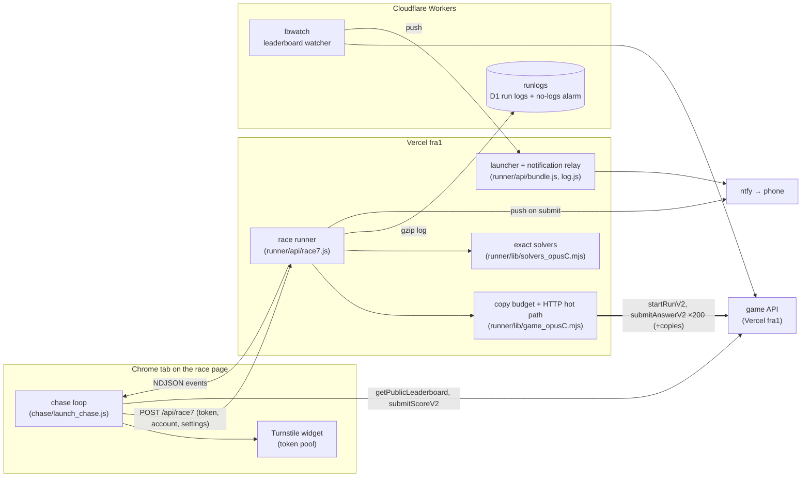
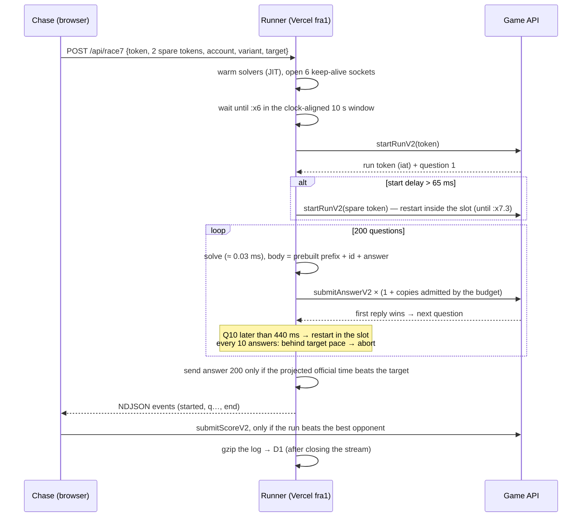

# agents-war — team pol0nium

Our racer for the SuperChallenge **Agents War**: a race runner on Vercel (Frankfurt, next to the game), a
browser-driven "chase" loop that supplies Cloudflare Turnstile tokens and decides what to submit, and a few
Cloudflare Workers for logs and notifications.

Best run: **7.063 s** for 200 answers. pol0nium held #1 from 2026-10-04 (7.383 s) to 2026-10-06.

## Architecture



| Component | Runs on | Role |
|---|---|---|
| Race runner `runner/api/race7.js` | Vercel function, `fra1`, instance sharing off | Starts the run, answers 200 questions, streams events, uploads the log |
| Hot path + budgets `runner/lib/game_opusC.mjs` | same | undici `Agent.request`, prebuilt bodies, copies / hedges / retries, rate-limit budget |
| Solvers `runner/lib/solvers_opusC.mjs` | same | Exact answers for every puzzle family, ≈ 0.03 ms per question |
| Chase `chase/launch_chase.js` | Chrome tab | Mints Turnstile tokens, picks accounts and variants, calls the runner, decides submissions |
| Launcher endpoint `runner/api/bundle.js?file=chase` | Vercel | Serves the current chase script with the secret (sent as a header) and account counter filled in |
| Run logs `workers/runlogs` | Cloudflare Worker + D1 | Stores run logs (gzipped by the runner), alarms if no run is logged for 15 min |
| Leaderboard watcher `workers/lbwatch` | Cloudflare cron | Polls the leaderboard every 10 s (fingerprint first, diff only on change), pushes changes |
| Notification relay `runner/api/log.js` | Vercel | ntfy.sh refuses Cloudflare's shared IPs, so the Workers post through the runner |

## Race lifecycle



Everything slow happens before the clock starts (socket warm-up, solver JIT, phase wait). The race loop costs
**0.08 ms** per question between a reply and the next answer on the wire.

## Copies and the rate limit

- **The limiter** is an Upstash-style sliding window per run, aligned to the clock:
  `estimate = count(current 10 s window) + count(previous) × (1 − elapsed fraction)`, limit ≈ 248–250. A refused
  first copy needs retries; persistent refusals end the run. (Fitted on every refusal in our logs. Earlier
  "per second", "250 per 5 s" and "fixed window" models were coincidences of our request rates at the time.)
- **Copies**: the same answer sent twice at once comes back sooner — best of 2 ≈ 44.6 ms vs 50.7 ms single.
- **Phase-aware allocator**: before each extra copy, the runner projects the estimate at every first copy still to
  come and admits the copy only if the peak stays ≤ 244. Copies land early, where they are cheapest (early sends weigh
  less by the end of the run) and most useful (early questions are slower); Q1–3 get two extra copies.
  ≈ 120 extra copies per run, zero refusals.
- **Start at :x6**: a 7–8 s run spans two windows → ~310–350 requests instead of 250.
- Hedges at 120 / 400 / 900 ms; a stale `409` from a losing copy never wins while another copy is in flight.

## Chase loop

- **Token pool**: a background minter keeps 5 Turnstile tokens ready; each run gets 1 + 2 spares for in-slot restarts,
  unused spares go back. Turnstile only produces tokens in a visible tab, so `chase/keep_front.sh` brings Chrome to
  the front every 3 minutes.
- **Throwaway accounts** (`pz<N>.burner@example.com`, 9 plays each, never reused).
- **Variants** are picked at random per run and tagged in the run id, so they can be compared within the same time
  blocks — the server's speed drifts far more than any client setting.
- **Lanes**: one run per 10 s slot; a second lane turns on in fast phases (≥ 3 runs reached Q60 in 2 min).
- **Submission rule**: target = the best opponent's time; the runner's abort and final-answer hold use it too.
- **Kill switch**: the runner only accepts the current chase tag, so an orphaned tab can be retired remotely.

## What we measured

Per question: Vercel platform ≈ 25–27 ms (edge ≈ 5 + function invocation/routing ≈ 20), game logic ≈ 20 ms,
network fra1 → fra1 ≈ 2 ms, our loop 0.08 ms, solving 0.03 ms. Reply time: 37–39 ms in good phases, 41–45 ms
normally, 50–80 ms in bad phases; record runs need ≈ 34–35 ms sustained.

| Helped | Effect |
|---|---|
| Runner in `fra1` starting the run itself | no browser round trip on the clock (≈ −85 ms) |
| Second copy per answer | ≈ −6 ms on each copied answer |
| Sliding-window budget | 2–4 refused-and-retried answers per run (≈ 150–250 ms) → 0 |
| Phase-aware allocator vs even pacing | ≈ −1.4 ms per answer on Q11–100 |
| In-slot restarts with spare tokens | more serious attempts per 10 s slot |
| Second lane in fast phases | produced 8 of our 15 best runs |
| Vercel instance sharing (fluid compute) off | parallel lanes no longer share one CPU and socket pool |

Didn't help (tested side by side, within noise): undici `request` vs `dispatch` vs a raw TLS client vs Go
`net/http`; HTTP/2; other hosts (EC2 in all three `eu-central-1` AZs, Vercel Edge, Cloudflare) in read-only probes;
DNS/IP pinning; request compression; early reply parsing; delayed or 80 ms hedges; more than one extra copy outside
Q1–3; a third parallel lane (+3 ms per answer, game-side load). Questions can't be predicted: 480,427 prompts were
all distinct and independent of token, time and account.

Hurt us: **Turnstile token starvation** whenever the Chrome window was covered (screensaver, other windows, nights),
and instance sharing until we turned it off.

## Repository layout

| Path | What |
|---|---|
| `runner/` | Vercel project: race endpoint, hot path, budgets, solvers, launcher, relay |
| `chase/` | Chase launcher, form filler, keep-in-front script |
| `workers/runlogs`, `workers/lbwatch` | Cloudflare Workers (+ D1): run-log store and alarm, leaderboard watcher |
| `browser-extension/` | Chrome extension showing the full leaderboard |

## Running it

Secrets are placeholders: `<RUNNER_SECRET>`, `<NTFY_TOPIC>`, `<your-runner>`, `<your-subdomain>`, D1 ids.

```sh
cd runner && npm install && npm run deploy                                    # env: RUNNER_SECRET, CF_LOG_URL, NTFY_TOPIC
cd workers/runlogs && npx wrangler d1 create aw-runlogs && npx wrangler deploy  # secret: SECRET
```

Then open the race page in Chrome, run `chase/fill_form.js`, and load the launcher from the runner
(`/api/bundle?file=chase&acct=<N>` with header `x-secret`) as a script.
